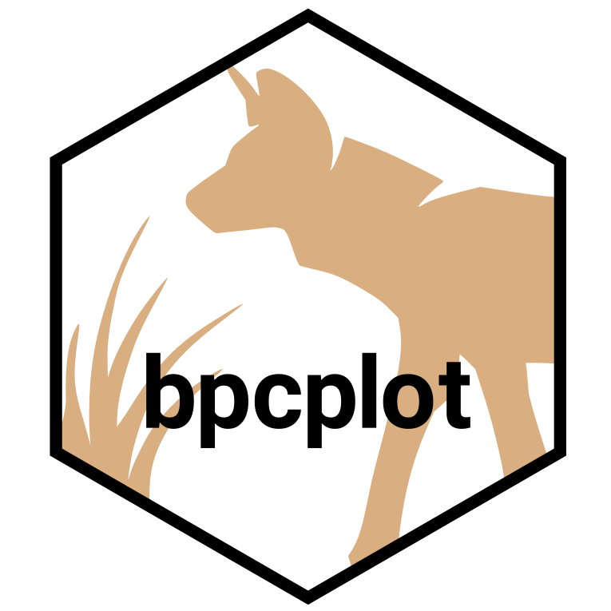
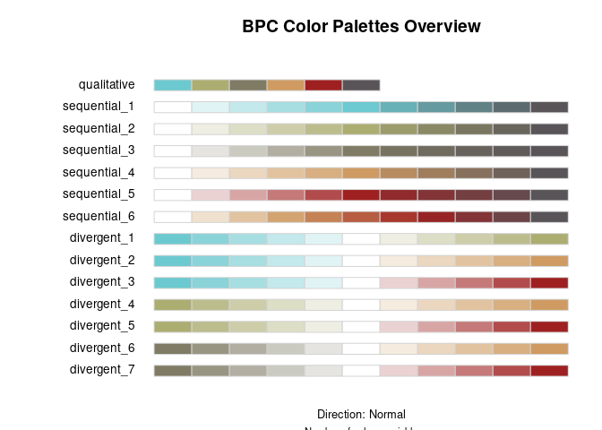
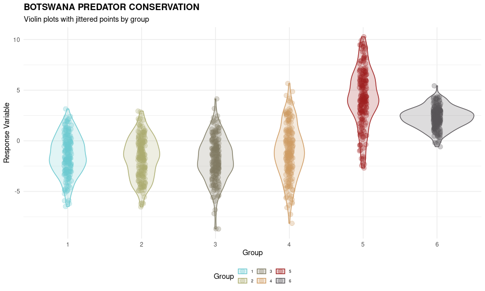
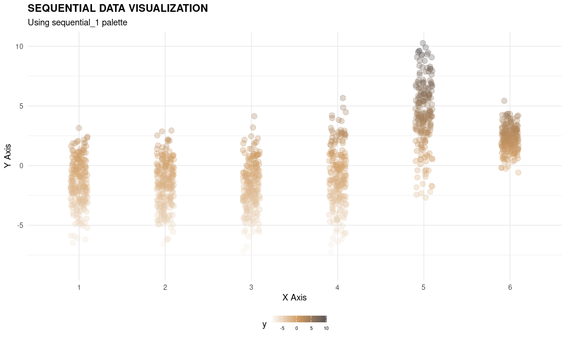
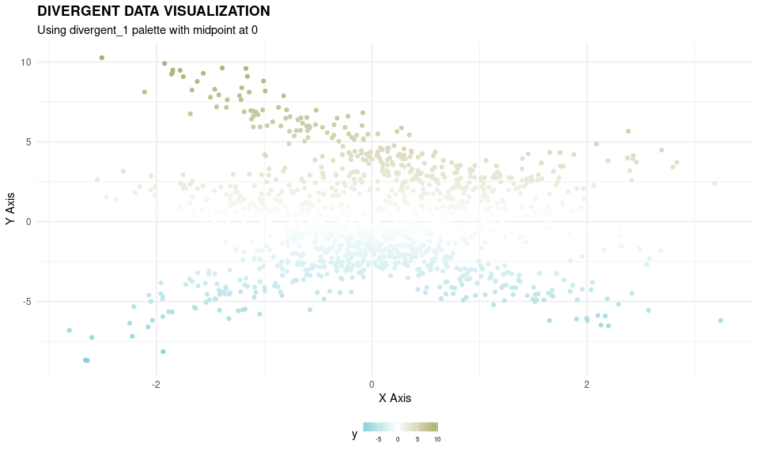
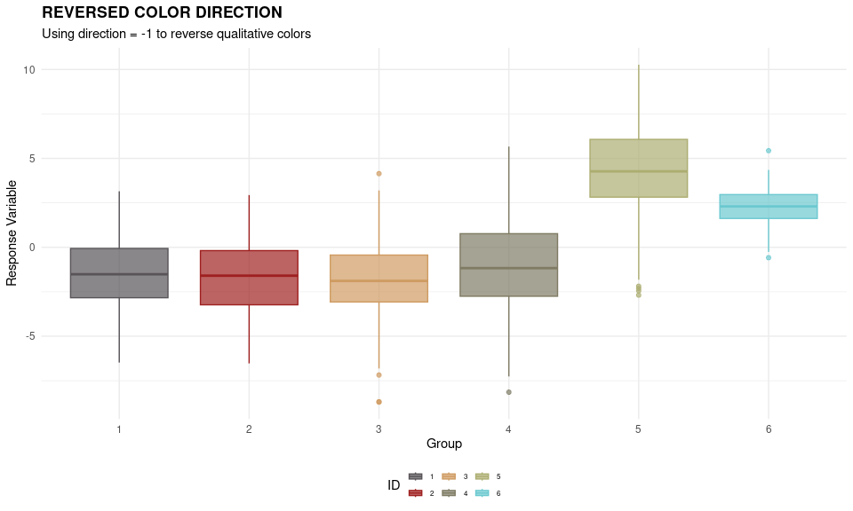
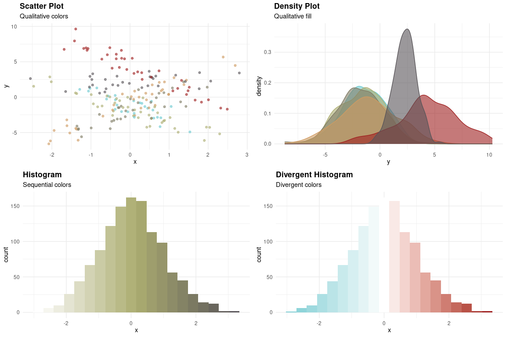

<!-- README.md is generated from README.Rmd. Please edit that file -->

# bpcplot 

`bpcplot` is an R-package that provides functionalities to easily
generate R figures that use BPC’s corporate colors.

## Installation

To install the latest version of the package, run the following command:

``` r
# Install from GitHub
devtools::install_github("daviddhofmann/bpcplot")

# Then load the package
library(bpcplot)
```

## Colors and Palettes

BPC’s color palette currently comprises six base colors. The `bpcplot`
package provides a few basic functions that apply these corporate colors
to your visualizations. You can use **qualitative**, **sequential**, and
**divergent** palettes. You can display those using `display_bpc_all()`.

``` r
library(bpcplot)
display_bpc_all()
```



To obtain the names of the colors of a particular palette, you can use
the `bpc_cols` function.

``` r
bpc_cols(palette = "qualitative")
#> [1] "#6CC9D0" "#ACAD71" "#7F7B64" "#CF9B62" "#9f2020" "#585458"
bpc_cols(palette = "sequential_1", n = 10)
#>  [1] "#FFFFFF" "#DEF3F4" "#BDE7EA" "#9DDBDF" "#7CCFD5" "#69BBC2" "#65A2A8"
#>  [8] "#60888D" "#5C6E72" "#585458"
bpc_cols(palette = "divergent_1", n = 10)
#>  [1] "#6CC9D0" "#8CD5DA" "#ADE1E4" "#CEEDEF" "#EEF9F9" "#F5F5EF" "#E3E3CF"
#>  [8] "#D0D1B0" "#BEBF90" "#ACAD71"
```

The package also provides functionalities to apply these palettes to
your ggplot figures. There are six main functions for this:

- `scale_color_bpc_qualitative()`
- `scale_fill_bpc_qualitative()`
- `scale_color_bpc_sequential()`
- `scale_fill_bpc_sequential()`
- `scale_color_bpc_divergent()`
- `scale_fill_bpc_divergent()`

Each of these also allow you to reverse the palettes using
`direction = -1`.

Finally, the package provides a custom BPC theme that you can apply to
your ggplots (`theme_bpc()`).

## Practical Examples

Let’s run a few practical examples to see these functions in action.

### Data Preparation

We start by simulating some data for a regression model.

``` r
# Load a few required packages
library(ggplot2)
library(dplyr)
library(ggpubr)

# Simulate some data
set.seed(123)
nid <- 6
n <- nid * 200
x <- rnorm(n)
e <- rnorm(n)
i <- as.factor(rep(1:nid, each = n / nid))
b0 <- rep(rnorm(nid, mean = 1, sd = 5), each = n / nid)
b1 <- rep(rnorm(nid, mean = 2, sd = 2), each = n / nid)
y <- b0 + b1 * x + e
dat <- data.frame(y = y, x = x, ID = i, intercept = b0, slope = b1)
```

### Example 1: Qualitative Scales

``` r
ggplot(dat, aes(x = ID, y = y, fill = ID, color = ID)) +
  geom_violin(width = 1, alpha = 0.2) +
  geom_jitter(width = 0.05, size = 3, alpha = 0.3) +
  scale_color_bpc_qualitative(name = "Group") +
  scale_fill_bpc_qualitative(name = "Group") +
  theme_bpc() +
  labs(
      title    = "BOTSWANA PREDATOR CONSERVATION"
    , subtitle = "Violin plots with jittered points by group"
    , x        = "Group"
    , y        = "Response Variable"
  )
```



### Example 2: Sequential Scales

``` r
ggplot(dat, aes(x = ID, y = y, color = y)) +
  geom_jitter(width = 0.1, size = 3, alpha = 0.3) +
  scale_color_bpc_sequential("sequential_4") +
  theme_bpc() +
  labs(
      title    = "SEQUENTIAL DATA VISUALIZATION"
    , subtitle = "Using sequential_1 palette"
    , x        = "X Axis"
    , y        = "Y Axis"
    , fill     = "Value"
  )
```



### Example 3: Divergent Scales

``` r
ggplot(dat, aes(x = x, y = y, color = y)) +
  geom_point() +
  scale_color_bpc_divergent("divergent_1", midpoint = 0) +
  theme_bpc() +
  labs(
      title    = "DIVERGENT DATA VISUALIZATION"
    , subtitle = "Using divergent_1 palette with midpoint at 0"
    , x        = "X Axis"
    , y        = "Y Axis"
    , fill     = "Deviation"
  )
```



### Example 4: Reversed Direction

``` r
ggplot(dat, aes(x = ID, y = y, color = ID, fill = ID)) +
  geom_boxplot(alpha = 0.7) +
  scale_color_bpc_qualitative(direction = -1) +
  scale_fill_bpc_qualitative(direction = -1) +
  theme_bpc() +
  labs(
      title    = "REVERSED COLOR DIRECTION"
    , subtitle = "Using direction = -1 to reverse qualitative colors"
    , x        = "Group"
    , y        = "Response Variable"
  )
```



### Example 5: Combined Plot

``` r
# Create multiple small examples
ex1 <- ggplot(dat %>% sample_n(200), aes(x = x, y = y, color = ID)) +
  geom_point(alpha = 0.6) +
  scale_color_bpc_qualitative() +
  labs(title = "Scatter Plot", subtitle = "Qualitative colors") +
  theme_bpc() +
  theme(legend.position = "none")

ex2 <- ggplot(dat, aes(x = y, fill = ID, color = ID)) +
  geom_density(alpha = 0.6) +
  scale_fill_bpc_qualitative() +
  scale_color_bpc_qualitative() +
  labs(title = "Density Plot", subtitle = "Qualitative fill") +
  theme_bpc() +
  theme(legend.position = "none")

ex3 <- ggplot(dat, aes(x = x, fill = after_stat(x))) +
  geom_histogram(bins = 20) +
  scale_fill_bpc_sequential("sequential_2") +
  labs(title = "Histogram", subtitle = "Sequential colors") +
  theme_bpc() +
  theme(legend.position = "none")

ex4 <- ggplot(dat, aes(x = x, fill = after_stat(x))) +
  geom_histogram(bins = 20) +
  scale_fill_bpc_divergent("divergent_3", midpoint = 0) +
  labs(title = "Divergent Histogram", subtitle = "Divergent colors") +
  theme_bpc() +
  theme(legend.position = "none")

# Combine plots
ggarrange(ex1, ex2, ex3, ex4)
```



## Best Practices

1.  **Use qualitative palettes** for categorical data with distinct
    groups
2.  **Use sequential palettes** for ordered data that progresses from
    low to high
3.  **Use divergent palettes** for data with a meaningful midpoint
4.  **Use the theme_bpc()** for consistent styling across all
    organization plots

## Conclusion

The `bpcplot` package provides a comprehensive set of tools for creating
consistent, branded visualizations that align with BPC’s corporate
identity. The package offers:

- 6 qualitative colors for categorical data
- 6 sequential palettes for ordered data
- 7 divergent palettes for data with midpoints
- A custom ggplot2 theme for consistent styling
- Easy reversal of color directions
- Seamless integration with ggplot2

For more information, see the function documentation with `?bpc_cols`,
`?theme_bpc`, or the individual scale functions.

A vignette that demonstrates usage of the package can be found here:
